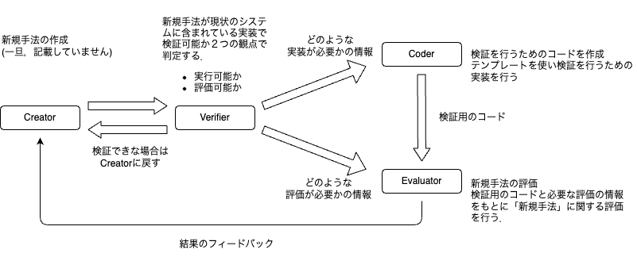

# AutoRes自動研究


## 開発者向け
- [フォルダー構成](https://github.com/auto-res/Mockup_python/blob/develop/docs/folder.md)
- [環境構築](https://www.notion.so/dead026297e04a9399987ea8e02df1da)
- [開発ルール](https://github.com/auto-res/Mockup_python/blob/develop/docs/development_rule.md)
- [デモアプリについて](https://github.com/auto-res/Mockup_python/tree/main/src/streamlit)


## リポジトリの説明




## 使い方
※整備中です

- Creator


- Coder
    - インスタンス化
```python
coder = Coder(
    llm_name = llm_name,
    save_dir="/Users/tanakatouma/vscode/Mockup_python/data/"
    )
```

    - 実行

```python
base_code_path = "/Users/tanakatouma/vscode/Mockup_python/data/base_model.txt"
new_method_path = "/Users/tanakatouma/vscode/Mockup_python/data/new_method.txt"
file_name = 'exec_code.py'

exec_code_path = coder.exec(base_code_path, new_method_path, file_name)
```

- Evaluator
    - 実行方法
    インスタンス化
    ```python
    eval = Evaluator(
        llm_name=llm_name,
        dataset_name='cifar10',
        params=params,
        valuation_index='accuracy',
        datasave_path='../../data',
        n_trials=10,
        )
    ```
    実行
    ```python
    result = eval.exec(exec_code_path)
    ```
    - 利用可能なデータセット
        - CIFAR10
        ```python
        dataset_name='cifar100'
        ```
        - CIFAR100
        ```python
        dataset_name='cifar100'
        ```
        - MNIST
        ```python
        dataset_name='mnist'
        ```
        - Fashion MNIST
        ```python
        dataset_name='fashion_mnist'
        ```
    - 評価指標
        - 二値分類
        - マルチクラス分類
        - 回帰

- 利用可能なLLM
    - OpenAI
        - gpt-4-turbo-preview
        ```python
        llm_name == "gpt-4-turbo-preview"
        ```
         - gpt-4-turbo-2024-04-09
        ```python
        llm_name == "gpt-4-turbo-2024-04-09"
        ```
        - gpt-3.5-turbo-0125
        ```python
        llm_name == "gpt-3.5-turbo-0125"
        ```
    - Google
        - gemini-pro
        ```python
        llm_name == "gemini-pro"
        ```
    - Anthropic
        - claude-3-opus-20240229
        ```python
        llm_name == "claude-3-opus-20240229"
        ```
